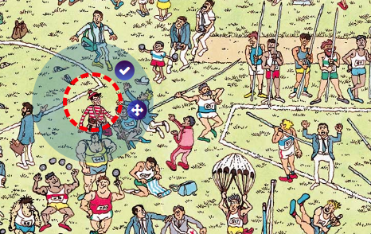
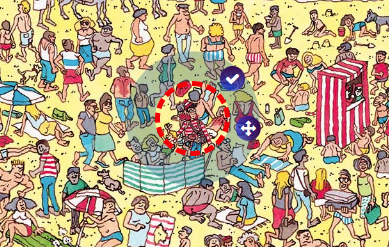

# Where's Wally (Waldo)?
Use Waldo's signature specs to bring into focus where he might be hiding and see how fast you can find that quirky little fellow.

## The Challenge

Create a unique re-interpretation on the classic game of "Where's Waldo". A game that displays two offset images in focus, while giving the illusion that Waldo's glasses are making clear a third, blurred-out image.

### CHALLENGE ACCEPTED!

### CHALLENGE ACCEPTED...AGAIN!
Create an admin screen, that allows admins the mark where Waldo is hidden, on various screens. Admins can drag a selection window to record Waldo's position, updating game object.

### Technology & Tools

  

### Future Plans

- display winner's circle with timestamps of best players
- move localStorage data to nosql database
- make all game logic more dynamic and css responsive
- add sockets to allow for multiplayer, real-time game play